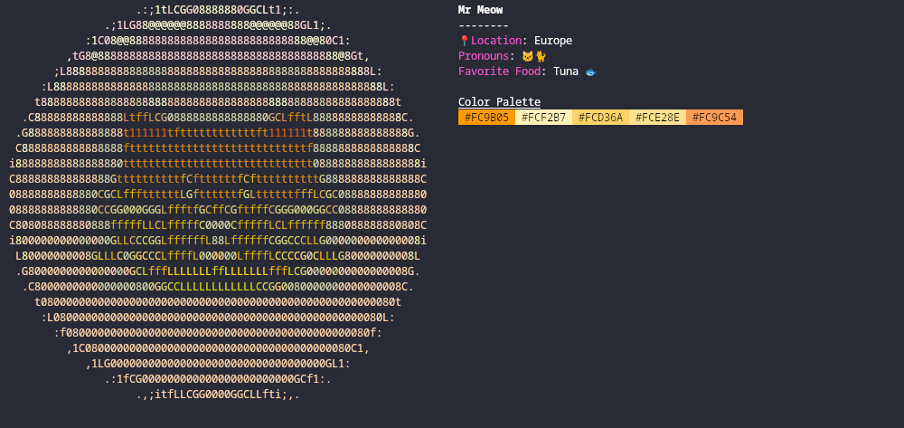

# YCH (Your Character Here)

✨Show info about your character right in your terminal✨


## Installation

Install using go

```sh
go get github.com/tekofx/ych
```

## Configuration

- In `$HOME/.config/ych` place a picture (.JPG or .PNG).
- Run the app `ych`. This will generate a new settings.json.

### Customize

The data shown can be customized in the JSON file `$HOME/.config/ych/settings.json`.

```json
{
  "name": "Name",
  "palette": ["#FFFFFF", "#000000"],
  "data": {
    "Gender": "Gender",
    "Pronouns": "Pronouns",
    "Species": "Species"
  },
  "quote": "No one is born into this world to be alone"
}
```

The fields in data can be any pair of strings.

# Example



## Config

```json
{
  "name": "Mr Meow",
  "palette": ["#FC9B05", "#FCF2B7", "#FCD36A", "#FCE28E", "#FC9C54"],
  "data": {
    "📍Location": "Europe",
    "Pronouns": "🐱🐈",
    "Favorite Food": "Tuna 🐟"
  }
}
```
